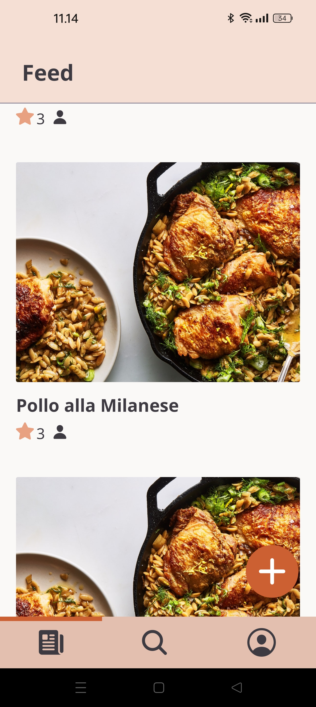

# Truffle


The app can be used with Expo Go with the following Expo URLs:
- **Android:** exp://u.expo.dev/update/f1715a27-b653-4e4d-966a-2fb7bc55e57f
- **iOS:** exp://u.expo.dev/update/d64a2b59-e0a5-4283-9489-fce4a24be9a3

The backend can be accessed here:
https://truffle-server.fly.dev

## Description

Simple social media app for creating, sharing and rating recipes with your friends!

## Installation

1. Install Docker
2. Clone git repository
3. Copy .env.sample and rename to => .env in client, server and flyway

### Server

1. Navigate to /server and copy .env.sample file and rename as .env
2. Run server and database with "docker compose up" in root directory

### Client

1. Navigate to /client and install client components with "bun install"
2. copy .env.sample file and rename as .env
3. Run client with "bun start"

### Database

1. Navigate to /flyway and copy .env.sample file and rename as .env

## Running the application

    docker compose up --build

- Read QR code with Expo Go to test app
or
- Change "npm start" in client/Dockerfile to "npm run web" to test via browser
    - Make sure not to commit this change

## Git

### Rebasing

```sh
    git branch -u origin/main

    git rebase origin/main

    # After solving merge conflicts

    git rebase --continue

    git push --force-with-lease origin <branch>
```


